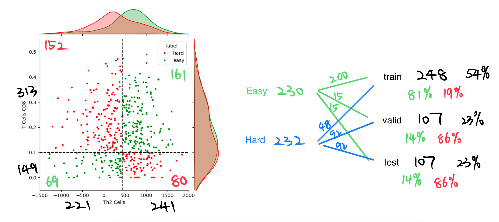
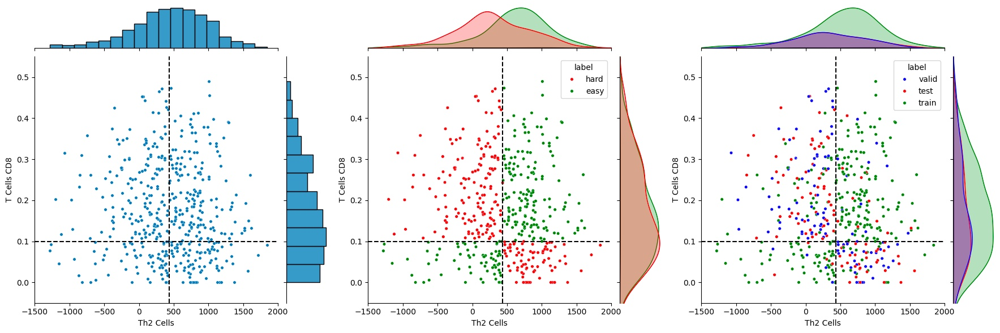

## Environment

The code is tested with `Python=3.10`, `PyTorch=2.2`, and `CUDA=11.8`. We 
recommend you to use [Miniconda](https://docs.conda.io/en/latest/miniconda.html)
or [Anaconda](https://www.anaconda.com/) to make sure that all dependencies are 
in place. To create an conda environment:
```bash
# clone the repository
git clone git@github.com:tianrui-qi/SIP-DB2.git
cd SIP-DB2
# create the conda environment
conda env create -f environment-cpu.yml     # cpu env
conda env create -f environment-gpu.yml     # gpu env
conda activate SIP-DB2
# uninstall triton to solve env problem
pip uninstall triton
```

## Data Structure

```plaintext
/mnt/efs_v2/dbgap_tcga/users/tianrui.qi/SIP-DB2/data/
├── snps.h5
├── label.csv
├── profile.csv         # samples profile of stanford and tcgaskcm dataset
├── fastq/              # unaligned reads
│   ├── SRR8924580/         # sample id
│   │   ├── *R1.fastq.gz        # read 1
│   │   └── *R2.fastq.gz        # read 2
│   └── ...
├── ref/                # reference for alignment
│   ├── ref.fa              # reference genome
│   └── ...                 # corresponding index
├── bwa-mem2-2.2.1_x64-linux
├── sam/                # aligned reads by bwa-mem2
│   ├── SRR8924580.sam
│   └── ...
├── bam/                # sorted aligned reads by Samtools
│   ├── SRR8924580.bam      # sorted bam file
│   ├── SRR8924580.bam.bai  # corresponding index
│   └── ...
├── embd/
│   ├── SRR8924580/
│   │   ├── 1/                  # chr 1 embedding
│   │   │   ├── 000/
│   │   │   │   ├── 000.npy
│   │   │   │   └── ...
│   │   │   ├── ...
│   │   │   └── feature.npy         # chr 1 embedding after feature selection
│   │   ├── ...
│   │   ├── X/                  # chr X embedding
│   │   └── sequence.h5         # sequence of sample
│   ├── ...
│   ├── TCGA-3N-A9WB-06A/
│   └── ...
```

## SNPs

SNPs define genomic variant at a single base position in the DNA sequence, from 
Chr 1 to 22 and X. There are 7 SNPs:

- `/mnt/s3/rgc-ag-data/app_data/yoga/Prod/gwas/817718/Meta.BCConly.COLORADO_Freeze_One__MAYO-CLINIC_Freeze_Two__SINAI_Freeze_Two__UCLA_Freeze_One__UKB_Freeze_450__UPENN-PMBB_Freeze_Two.EUR.Meta_Combined.tsv.gz`
- `/mnt/s3/rgc-ag-data/app_data/fuma/Prod/gwas/91144/snps.txt`
- `/mnt/s3/rgc-ag-data/app_data/fuma/Prod/gwas/91144/all_snps.txt.gz`
- `/mnt/s3/rgc-ag-data/app_data/fuma/Prod/gwas/91144/all_rare_snps.txt.gz`
- `/mnt/s3/rgc-ag-data/app_data/fuma/Prod/gwas/116940/snps.txt`
- `/mnt/s3/rgc-ag-data/app_data/fuma/Prod/gwas/116940/all_snps.txt.gz`
- `/mnt/s3/rgc-ag-data/app_data/fuma/Prod/gwas/116940/all_rare_snps.txt.gz`

We format columns name of 7 SNPs, keep column `Chr`, `Pos`, and `Pval`, concat 
them together, drop duplicate while keep the one with smallest p-vale, and 
save to `data/snps.h5`.

```python
import pandas as pd
# read the snps
snps0 = pd.read_csv(
    "/mnt/s3/rgc-ag-data/app_data/yoga/Prod/gwas/817718/Meta.BCConly.COLORADO_Freeze_One__MAYO-CLINIC_Freeze_Two__SINAI_Freeze_Two__UCLA_Freeze_One__UKB_Freeze_450__UPENN-PMBB_Freeze_Two.EUR.Meta_Combined.tsv.gz", 
    usecols=["Chr", "Pos", "Pval"], sep="\t",
)
snps1 = pd.read_csv(
    "/mnt/s3/rgc-ag-data/app_data/fuma/Prod/gwas/91144/snps.txt", 
    usecols=["Chr", "Pos", "P"], sep="\t"
)
snps2 = pd.read_csv(
    "/mnt/s3/rgc-ag-data/app_data/fuma/Prod/gwas/91144/all_snps.txt.gz",
    usecols=["#Chr", "Pos", "P"], sep="\t"
)
snps3 = pd.read_csv(
    "/mnt/s3/rgc-ag-data/app_data/fuma/Prod/gwas/91144/all_rare_snps.txt.gz", 
    usecols=["#Chr", "Pos", "P"], sep="\t"
)
snps4 = pd.read_csv(
    "/mnt/s3/rgc-ag-data/app_data/fuma/Prod/gwas/116940/snps.txt", 
    usecols=["Chr", "Pos", "P"], sep="\t"
)
snps5 = pd.read_csv(
    "/mnt/s3/rgc-ag-data/app_data/fuma/Prod/gwas/116940/all_snps.txt.gz",
    usecols=["#Chr", "Pos", "P"], sep="\t"
)
snps6 = pd.read_csv(
    "/mnt/s3/rgc-ag-data/app_data/fuma/Prod/gwas/116940/all_rare_snps.txt.gz", 
    usecols=["#Chr", "Pos", "P"], sep="\t"
)
# format columns
snps1.rename(columns={"P": "Pval"}, inplace=True)
snps2.rename(columns={"#Chr": "Chr", "P": "Pval"}, inplace=True)
snps3.rename(columns={"#Chr": "Chr", "P": "Pval"}, inplace=True)
snps4.rename(columns={"P": "Pval"}, inplace=True)
snps5.rename(columns={"#Chr": "Chr", "P": "Pval"}, inplace=True)
snps6.rename(columns={"#Chr": "Chr", "P": "Pval"}, inplace=True)
# concat
snps = pd.concat(
    [snps0, snps1, snps2, snps3, snps4, snps5, snps6], ignore_index=True
)
# sort by Chr, Pos, and Pval
snps = snps.sort_values(by=["Chr", "Pos", "Pval"]).reset_index(drop=True)
# drop duplicates and keep the one with the smallest pval
snps = snps.drop_duplicates(subset=["Chr", "Pos"], keep="first")
# save
# split snps_df by chromosome, use chromsome as key and save each part in hdf5
for c in [str(i) for i in range(1, 23)] + ["X"]:
    snps_c = snps_df[snps_df["Chr"] == int(c if c != "X" else "23")]
    snps_c.drop(columns=["Chr"]).to_hdf(
        "data/snps.h5", key=f"/chr{c}", mode="a", format="f", index=False
    )
```

We can reduce the number of variant by setting a p-value threshold. 
To load the SNPs,

```python
import pandas as pd
chromosome = "1"
snps = pd.read_hdf("data/snps.h5", key=f"/chr{chromosome}")
print(snps.head().to_markdown())
```

|   | **Chr** | **Pos**  | **Pval**  |
| - | ------- | -------: | :-------- |
| 0 | 1       | 10,894   | 0.4351    |
| 1 | 1       | 10,915   | 0.1753    |
| 2 | 1       | 10,930   | 0.7586    |
| 3 | 1       | 10,989   | 0.0002593 |
| 4 | 1       | 11,171   | 0.1034    |

Table below shows the number of variant (bp) in total and in each chromosome 
with different p-value threshold (<) of variants. 
For example, (Chr 1, 1e-1) is 1,780,564 means there are 1,780,564 variants in 
chromosome 1 with p-value less than 1e-1.

|           | **Total**   | **Chr 1**  | **Chr 2**  | **Chr 3**  | **Chr 4**  | **Chr 5**  | **Chr 6**  | **Chr 7**  | **Chr 8**  | **Chr 9**  | **Chr 10** | **Chr 11** |
| :-------- | ----------: | ---------: | ---------: | ---------: | ---------: | ---------: | ---------: | ---------: | ---------: | ---------: | ---------: | ---------: | 
| **None**  | 102,005,793 | 8,036,737  | **8,420,567**  | 6,910,271  | 6,660,538  | 6,227,603  | 5,974,465  | 5,671,878  | 5,371,679  | 4,328,197  | 4,771,438  | 4,967,986  |
| **1e+00** | 102,004,384 | 8,036,624  | **8,420,460**  | 6,910,178  | 6,660,453  | 6,227,521  | 5,974,367  | 5,671,807  | 5,371,599  | 4,328,148  | 4,771,371  | 4,967,903  |
| **1e-01** | 22,526,232  | 1,780,564  | **1,842,034**  | 1,525,348  | 1,463,394  | 1,369,596  | 1,352,671  | 1,241,372  | 1,190,281  | 958,209    | 1,055,550  | 1,110,927  |
| **1e-02** | 3,015,759   | 240,594    | **247,397**    | 203,549    | 192,705    | 180,543    | 208,849    | 162,457    | 154,899    | 126,389    | 138,882    | 150,371    |
| **1e-03** | 474,261     | 37,485     | 39,188     | 28,721     | 26,360     | 26,907     | **54,400**     | 23,818     | 22,224     | 20,078     | 19,893     | 23,188     |
| **1e-04** | 122,713     | 8,739      | 10,841     | 5,754      | 4,456      | 5,730      | **30,131**     | 5,188      | 4,262      | 5,538      | 3,833      | 5,178      |
| **1e-05** | 61,958      | 3,433      | 4,968      | 1,849      | 1,246      | 2,369      | **23,903**     | 2,198      | 1,558      | 2,742      | 1,343      | 2,416      |
| **1e-06** | 44,522      | 2,076      | 3,189      | 952        | 737        | 1,482      | **20,856**     | 1,492      | 895        | 1,895      | 721        | 1,733      |

|           | **Chr 12**  | **Chr 13** | **Chr 14** | **Chr 15** | **Chr 16** | **Chr 17** | **Chr 18** | **Chr 19** | **Chr 20** | **Chr 21** | **Chr 22** | **Chr X**  |
| :-------- | ----------: | ---------: | ---------: | ---------: | ---------: | ---------: | ---------: | ---------: | ---------: | ---------: | ---------: | ---------: |
| **None**  | 4,737,294   | 3,380,686  | 3,127,090  | 2,900,385  | 3,320,540  | 3,024,415  | 2,669,604  | 2,523,250  | 2,229,241  | 1,257,735  | 1,419,036  | 4,075,158  |
| **1e+00** | 4,737,230   | 3,380,632  | 3,127,049  | 2,900,341  | 3,320,476  | 3,024,375  | 2,669,581  | 2,523,220  | 2,229,203  | 1,257,715  | 1,419,019  | 4,075,112  |
| **1e-01** | 1,043,093   | 747,757    | 681,930    | 643,814    | 737,973    | 667,146    | 578,764    | 556,385    | 503,376    | 279,032    | 313,435    | 883,581    |
| **1e-02** | 135,799     | 95,282     | 90,206     | 86,005     | 100,432    | 91,538     | 73,734     | 73,028     | 73,277     | 36,473     | 41,223     | 112,127    |
| **1e-03** | 20,648      | 13,619     | 13,210     | 12,439     | 16,633     | 15,152     | 9,936      | 10,015     | 15,279     | 4,882      | 6,355      | 13,831     |
| **1e-04** | 4,975       | 2,335      | 2,287      | 2,206      | 4,927      | 2,528      | 1,468      | 1,790      | 6,106      | 719        | 1,520      | 2,202      |
| **1e-05** | 2,583       | 779        | 586        | 744        | 2,882      | 801        | 348        | 506        | 3,358      | 209        | 621        | 516        |
| **1e-06** | 1,833       | 448        | 97         | 287        | 1,916      | 310        | 218        | 222        | 2,529      | 94         | 372        | 168        |

## Profile

The profile store in `data/profile.csv`, contain profile for both Stanford and 
TCGA SKCM dataset. 
Stanford profile refers to 
`/mnt/s3/rgc-tag-onc-jh1-resources/2019_natBiotech_anneChang_bccWXS/SraRunTable_PRJNA533341_2018_bccWXS.txt`; 
TCGA SKCM profile refers to 
`/mnt/efs_v2/dbgap_tcga/users/jing.he1/mol_pheno/TCGA_SKCM/gdc_sample_sheet.2024-02-05.tsv`.

To use the profile,

```python
import pandas as pd
profile = pd.read_csv("data/profile.csv")
## Stanford
profile_stanford = profile[profile["dataset"]=="stanford"]
print(profile_stanford.head().to_markdown())
## TCGA SKCM
profile_tcgaskcm = profile[profile["dataset"]=="tcgaskcm"]
print(profile_tcgaskcm.head().to_markdown())
```

|        | **dataset** | **patient**  | **sample**       | **type**             | **easy** | **hard** | **train** | **valid** | **test** |
| ------ | ----------- | ------------ | ---------------- | -------------------- | -------- | -------- | --------- | --------- | -------- |
| **0**  | stanford    | su001        | SRR8924591       | normal skin          | 1        | 0        | 1         | 0         | 0        |
| **1**  | stanford    | su001        | SRR8924590       | BCC tumor            | 1        | 0        | 1         | 0         | 0        |
| **2**  | stanford    | su001        | SRR8924593       | BCC tumor            | 1        | 0        | 1         | 0         | 0        |
| **3**  | stanford    | su002        | SRR8924592       | normal skin          | 1        | 0        | 1         | 0         | 0        |
| **4**  | stanford    | su002        | SRR8924594       | BCC tumor            | 1        | 0        | 1         | 0         | 0        |
| **23** | tcgaskcm    | TCGA-3N-A9WB | TCGA-3N-A9WB-06A | Metastatic           | 0        | 1        | 0         | 1         | 0        |
| **24** | tcgaskcm    | TCGA-3N-A9WB | TCGA-3N-A9WB-10A | Blood Derived Normal | 0        | 1        | 0         | 1         | 0        |
| **25** | tcgaskcm    | TCGA-3N-A9WC | TCGA-3N-A9WC-06A | Metastatic           | 0        | 1        | 0         | 0         | 1        |
| **26** | tcgaskcm    | TCGA-3N-A9WC | TCGA-3N-A9WC-10A | Blood Derived Normal | 0        | 1        | 0         | 0         | 1        |
| **27** | tcgaskcm    | TCGA-3N-A9WD | TCGA-3N-A9WD-06A | Metastatic           | 0        | 1        | 0         | 1         | 0        |

|        | **bam_path**                                                                                                                                          | **embd_fold**                                                              |
| ------ | ----------------------------------------------------------------------------------------------------------------------------------------------------- | -------------------------------------------------------------------------- |
| **0**  | /mnt/efs_v2/dbgap_tcga/users/tianrui.qi/SIP-DB2/data/bam/SRR8924591.bam                                                                               | /mnt/efs_v2/dbgap_tcga/users/tianrui.qi/SIP-DB2/data/embd/SRR8924591       |
| **1**  | /mnt/efs_v2/dbgap_tcga/users/tianrui.qi/SIP-DB2/data/bam/SRR8924590.bam                                                                               | /mnt/efs_v2/dbgap_tcga/users/tianrui.qi/SIP-DB2/data/embd/SRR8924590       |
| **2**  | /mnt/efs_v2/dbgap_tcga/users/tianrui.qi/SIP-DB2/data/bam/SRR8924593.bam                                                                               | /mnt/efs_v2/dbgap_tcga/users/tianrui.qi/SIP-DB2/data/embd/SRR8924593       |
| **3**  | /mnt/efs_v2/dbgap_tcga/users/tianrui.qi/SIP-DB2/data/bam/SRR8924592.bam                                                                               | /mnt/efs_v2/dbgap_tcga/users/tianrui.qi/SIP-DB2/data/embd/SRR8924592       |
| **4**  | /mnt/efs_v2/dbgap_tcga/users/tianrui.qi/SIP-DB2/data/bam/SRR8924594.bam                                                                               | /mnt/efs_v2/dbgap_tcga/users/tianrui.qi/SIP-DB2/data/embd/SRR8924594       |
| **23** | /mnt/efs_v2/dbgap_tcga/users/jing.he1/mol_pheno/TCGA_SKCM/4602683e-928f-4865-8d51-9285428c2abd/e149f83f-8eb2-4070-8d42-04025272f6aa_wxs_gdc_realn.bam | /mnt/efs_v2/dbgap_tcga/users/tianrui.qi/SIP-DB2/data/embd/TCGA-3N-A9WB-06A |
| **24** | /mnt/efs_v2/dbgap_tcga/users/jing.he1/mol_pheno/TCGA_SKCM/5f9701a2-d948-4fa5-8d64-f43072d7540a/8d2f084c-bec2-4e3a-a8ea-8656ce95ddeb_wxs_gdc_realn.bam | /mnt/efs_v2/dbgap_tcga/users/tianrui.qi/SIP-DB2/data/embd/TCGA-3N-A9WB-10A |
| **25** | /mnt/efs_v2/dbgap_tcga/users/jing.he1/mol_pheno/TCGA_SKCM/f44a75cd-4144-4a66-bf1d-0b4c01a414af/e7e53fde-c59f-4933-a15b-38f81644d331_wxs_gdc_realn.bam | /mnt/efs_v2/dbgap_tcga/users/tianrui.qi/SIP-DB2/data/embd/TCGA-3N-A9WC-06A |
| **26** | /mnt/efs_v2/dbgap_tcga/users/jing.he1/mol_pheno/TCGA_SKCM/b684e03d-7977-44d6-963b-1c5e6146b8a9/a8305c9e-76a9-4e40-8451-6882718cbd76_wxs_gdc_realn.bam | /mnt/efs_v2/dbgap_tcga/users/tianrui.qi/SIP-DB2/data/embd/TCGA-3N-A9WC-10A |
| **27** | /mnt/efs_v2/dbgap_tcga/users/jing.he1/mol_pheno/TCGA_SKCM/1903af20-51f4-492c-bb91-591593e63b7f/67015753-00f8-4ccf-9899-a64ccf879a1d_wxs_gdc_realn.bam | /mnt/efs_v2/dbgap_tcga/users/tianrui.qi/SIP-DB2/data/embd/TCGA-3N-A9WD-06A |

|        | **Treatment**  | **Th2 Cells** | **T Cells CD8** |
| ------ | -------------- | ------------- | --------------- |
| **0**  | pre anti-PD-1  | nan           | nan             |
| **1**  | post anti-PD-1 | nan           | nan             |
| **2**  | pre anti-PD-1  | nan           | nan             |
| **3**  | post anti-PD-1 | nan           | nan             |
| **4**  | pre anti-PD-1  | nan           | nan             |
| **23** | nan            | 1123.27       | 0.0401951       |
| **24** | nan            | 1123.27       | 0.0401951       |
| **25** | nan            | \-424.94      | 0.306577        |
| **26** | nan            | \-424.94      | 0.306577        |
| **27** | nan            | \-373.574     | 0.131067        |

All Stanford samples are group to easy and train set. 
For TCGA SKCM samples,





```python
import pandas as pd

th2_bound = 439.13  # label["Th2 Cells"].mean()
cd8_bound = 0.1

# read profile
profile = pd.read_csv("data/profile.csv")
profile = profile[profile["dataset"]=="tcgaskcm"]
profile = profile[profile["embd_fold"].notnull()]
# read label
label   = pd.read_csv("data/label.csv")
# remove sample in profile that not in label
# remove patient in label that not in profile
profile = profile[profile["patient"].isin(label["patient"])]
label = label[label["patient"].isin(profile["patient"])]
# remove patient that only have one sample in profile
for i in label["patient"].to_list():
    if len(profile[profile["patient"] == i]) < 2:
        label = label[label["patient"] != i]
        profile = profile[profile["patient"] != i]

# init split where index match label
split = pd.read_csv(
    "data/label.csv", usecols=["patient", "Th2 Cells", "T Cells CD8"]
)
split[["easy", "hard", "train", "valid", "test"]] = 0
# split easy, hard
split[["easy", "hard"]] = 0
split.loc[label[
    ((label["Th2 Cells"] > th2_bound) & (label["T Cells CD8"] > cd8_bound)) | 
    ((label["Th2 Cells"] < th2_bound) & (label["T Cells CD8"] < cd8_bound))
].index, "easy"] = 1
split.loc[label[
    ((label["Th2 Cells"] > th2_bound) & (label["T Cells CD8"] < cd8_bound)) | 
    ((label["Th2 Cells"] < th2_bound) & (label["T Cells CD8"] > cd8_bound))
].index, "hard"] = 1
# split easy into train, valid, test
easy = label.loc[split[split["easy"] == 1].index]
easy = easy.sort_values(by=["Th2 Cells", "T Cells CD8"])
for i in range(len(easy)):
    mod = 15
    if   i % mod < mod-2: split.loc[easy.index[i], "train"] = 1  # 200
    elif i % mod < mod-1: split.loc[easy.index[i], "valid"] = 1  # 15
    elif i % mod < mod-0: split.loc[easy.index[i], "test"]  = 1  # 15
# split hard into train, valid, test
hard = label.loc[split[split["hard"] == 1].index]
hard = hard.sort_values(by=["Th2 Cells", "T Cells CD8"])
for i in range(len(hard)):
    mod = 10
    if   i % mod <   2: split.loc[hard.index[i], "train"] = 1   # 48
    elif i % mod <   6: split.loc[hard.index[i], "valid"] = 1   # 92
    elif i % mod < mod: split.loc[hard.index[i], "test"]  = 1   # 92

# save
profile = pd.read_csv("data/profile.csv")
profile = profile[profile["dataset"]=="tcgaskcm"]
profile = profile.merge(split, on="patient", how="left")
# note that there are patient in profile that not in label/split
profile[["easy", "hard", "train", "valid", "test"]] = profile[
    ["easy", "hard", "train", "valid", "test"]
].fillna(0).astype(int)
profile.to_csv("data/profile-tcgaskcm.csv", index=False)
```

To filter samples in profile, i.e., train, 

```python
import pandas as pd
profile = pd.read_csv("data/profile.csv")
profile = profile[profile["train"]==1]
```

## FASTQ

Raw FASTQ, unaligned reads,  store in `data/fastq/`, contain 23 samples, copy 
from 
`/mnt/s3/rgc-tag-onc-jh1-resources/2019_natBiotech_anneChang_bccWXS/fastq/`. 
For each sample, we have two reads, i.e., `*R1.fastq.gz` and `*R2.fastq.gz`.

To mount the S3 bucket `rgc-tag-onc-jh1-resources` (like HDD/SSD in desktop) of 
raw data, follow the 
[How to guide](https://confluence.regeneron.com/display/SUG/How+to+Install%2C+Configure%2C+and+Use+FUSE+for+S3+Mount). 
First, type `id` in cmd and copy the `uid`. 
Then, run cmd

```shell
# usage
sudo s3fs [S3 BUCKET NAME] [MOUNT PATH] -o allow_other,use_sse=1,endpoint=us-east-1,uid=[YOUR UID],gid=1121400513,iam_role=auto

# e.g.
sudo s3fs rgc-tag-onc-jh1-resources /mnt/s3/rgc-tag-onc-jh1-resources -o allow_other,use_sse=1,endpoint=us-east-1,uid=777332657,gid=1121400513,iam_role=auto
```

Type `df -h` to check if the filesystem is mounted where `-h` means human readable.

## FASTQ to SAM

Use [bwa-mem2](https://github.com/bwa-mem2/bwa-mem2) to align the FASTQ in SAM, 
stands for Sequence Alignment Map. 
To install it,

```shell
# intall bwa-mem2
curl -L https://github.com/bwa-mem2/bwa-mem2/releases/download/v2.2.1/bwa-mem2-2.2.1_x64-linux.tar.bz2 | tar jxf -
# index the reference genome
bwa-mem2-2.2.1_x64-linux/bwa-mem2 index ref/ref.fa
```

where the reference genome `data/ref/ref.fa` copy from 
`/mnt/efs_v2/tag_onc/users/hossein.khiabanian/ref/genome.fa`

Then, we run alignment and store result of each sample in `data/sam/*.sam`:

```shell
# e.g., sample `SRR8924580`, powershell
$id = "SRR8924580";
bwa-mem2-2.2.1_x64-linux/bwa-mem2 mem -t 40 data/ref/ref.fa data/fastq/$id/*R1.fastq.gz data/fastq/$id/*R2.fastq.gz > data/sam/$id.sam;
# e.g., sample `SRR8924580` to `SRR8924602`, powershell
foreach ($i in 580..602) { 
    $id = "SRR8924$i"; 
    bwa-mem2-2.2.1_x64-linux/bwa-mem2 mem -t 40 data/ref/ref.fa data/fastq/$id/*R1.fastq.gz data/fastq/$id/*R2.fastq.gz > data/sam/$id.sam; 
}
```

where `-t` for number of threads.

## SAM to BAM

We convert SAM, Sequence Alignment Map, into BAM, Binary Alignment Map, using 
[Samtools](https://www.htslib.org). 
To install it,

```shell
# download source file
wget https://github.com/samtools/samtools/releases/download/1.19.2/samtools-1.19.2.tar.bz2
tar -xjf samtools-1.19.2.tar.bz2
cd samtools-1.19.2
# build and install
./configure     # using default prefix /usr/local/bin/samtools
make
make install    # may need sudo for this
# check installation
samtools
which samtools  # should print /usr/local/bin/samtools
# remove source file
cd ..
rm -rf samtools-1.19.2
rm samtools-1.19.2.tar.bz2
```

Then, convert SAM into BAM file,

```shell
# e.g., sample `SRR8924580`, powershell
$id = "SRR8924580";
## convert SAM to BAM
samtools view -@ 40 -S -b data/sam/$id.sam > data/bam/$id.bam;  
## sort BAM  
samtools sort -@ 40 data/bam/$id.bam -o data/bam/$id.bam;
## index sorted BAM file   
samtools index -@ 40 data/bam/$id.bam;
# e.g., sample `SRR8924580` to `SRR8924602`, powershell
foreach ($i in 580..602) { 
    $id = "SRR8924$i"; 
    samtools view -@ 40 -S -b data/sam/$id.sam > data/bam/$id.bam;
    samtools sort -@ 40 data/bam/$id.bam -o data/bam/$id.bam;
    samtools index -@ 40 data/bam/$id.bam;
}
```

where `-@` for number of threads. 
We can then use [pysam](https://pysam.readthedocs.io/en/stable/#) to read BAM 
and extract the reads.

## BAM and SNPs to Sequence

Go through reads in `-c CHROMOSOME` of `-B BAM_LOAD_PATH`. 
For each read, filter the read that is not paired, not properly paired, and not 
mapped; cut bases with quality less than `quality_thresh=16` at beginning and 
end of reads and short reads with length less than `length_thresh=96`. 
Note that this value is set according to Stanford data; change the length 
threshold accordingly for new dataset. Then, calculate num of variants cover by 
each read with different p-value threshold. Save result as a HDF5 
`-H HDF_SAVE_PATH` with columns `sequence`, `pos`, `1e+00`, `1e-01`, `1e-02`, 
`1e-03`, `1e-04`, `1e-05`, and `1e-06`. 
Seperate result by batch with key `/chr{chromosome}_batch{batch_index}` to save 
memory and avoid overflow error.

This function itself is not optimized for parallel computing but design for 
sample and chromosome level parallel, i.e., start mutiple process and run this 
function at the sample time. Refer to 
[`src/bam2seq.py`](src/bam2seq.py)
for the implementation.

-   `-B BAM_LOAD_PATH`: Path to load the BAM file of a sample. 
-   `-H HDF_SAVE_PATH`: Path to save the HDF5 file. Must assign differ path for 
    sample and chromosome. 
-   `-c CHROMOSOME`: Which chromosome current process want to process. 
    Parameter design for parallel.
-   `-S SNPS_LOAD_PATH`: Path to load the SNPs file contain genetic variation.
-   `-q QUALITY_THRESH`: Cut low quality bases at beginning and end of reads. 
    Default: 16.
-   `-l LENGTH_THRESH`: Skip reads with length less than this value. 
    Default: 96.
-   `-b BATCH_SIZE`: Frequence of create new key and save batch size of reads to
    this key. Default: 1e6.
-   `-v VERBAL`: Control which level of tqdm bar will be print. If set as 
    True/False, all the tqdm bar will be enabled/disabled. If set as int, print 
    tqdm bar with position samller than or equal to verbal. For example, if 
    verbal set to 1, print tqdm bar with position 0 and 1, i.e., level 0 and 1 
    for loop. 

The averge read length of TCGA-SKCM data is 75bp, so we set the length threshold to 64.

```python
import pandas as pd
import os
import src
chromosome = "1"
## Stanford
profile = pd.read_csv("data/profile.csv")
profile = profile[profile["dataset"]=="stanford"]
for i in range(len(profile)):
    embd_fold = profile.iloc[i, "embd_fold"]
    src.bam2seq(
        bam_load_path=profile.iloc[i, "bam_path"], 
        hdf_save_path=os.path.join(embd_fold, chromosome, "sequence.h5"),
        chromosome=chromosome,
        snps_load_path="data/snps.h5", 
    )
## TCGA SKCM
profile = pd.read_csv("data/profile.csv")
profile = profile[profile["dataset"]=="tcgaskcm"]
for i in range(len(profile)):
    embd_fold = profile.iloc[i, "embd_fold"]
    src.bam2seq(
        bam_load_path=profile.iloc[i, "bam_path"], 
        hdf_save_path=os.path.join(embd_fold, chromosome, "sequence.h5"), 
        chromosome=chromosome,
        snps_load_path="data/snps.h5", 
        length_thresh=64
    )
```

To use the HDF5,

```python
## Stanford
import pandas as pd
sample, chromosome= "SRR8924580", "1"
pval_thresh = 1e-3
# read hdf of given sample and chromosome
hdf = []
batch_index = 0
while True:
    try:
        hdf.append(pd.read_hdf(
            f"data/embd/{sample}/{chromosome}/sequence.h5", 
            key=f"/chr{chromosome}_batch{batch_index}", mode="r"
        ))
        batch_index += 1
    except KeyError: 
        break
hdf = pd.concat(hdf, ignore_index=True)
# filter reads that cover at least one variants with p-value<pval_thresh
hdf = hdf[hdf[f"{pval_thresh:.0e}"]>=1]
print(hdf.head().to_markdown())
```

|           | **sequence**                                                                                                                  | **pos**  | **1e+00** | **1e-01** | **1e-02** | **1e-03** | **1e-04** | **1e-05** | **1e-06** |
| --------- | :---------------------------------------------------------------------------------------------------------------------------- | -------: | --------- | --------- | --------- | --------- | --------- | --------- | --------- |
| **9610**  | TCTTGTAGCCCAGGCTGGAGTGCAATGGCACAATCTCAGCTCACTACAACCTCCACCTCCCGGGTTCAAGCAATTCTCCTGCCTCGGCCTCCCGAGTAGCTGGAATTATAGGGATGTGCCACAAC | 511,442  | 1         | 1         | 1         | 1         | 0         | 0         | 0         |
| **9611**  | AGGCTGGAGTGCAATGGCACAATCTCAGCTCACTACAACCTCCACCTCCCGGGTTCAAGCAATTCTCCTGCCTCGGCCTCCCGAGTAGCTGGAATTATAGGGATGTGCCACAACGCCTAGCTAAC | 511,453  | 1         | 1         | 1         | 1         | 0         | 0         | 0         |
| **9612**  | CTGGAGTGCAATGGCACAATCTCAGCTCACTACAACCTCCACCTCCCGGGTTCAAGCAATTCTCCTGCCTCGGCCTCCCGAGTAGCTGGAATTATAGGGATGTGCCACAACGCCTAGCTAACTGT | 511,456  | 1         | 1         | 1         | 1         | 0         | 0         | 0         |
| **9613**  | AAGCAATTCTCCTGCCTCGGCCTCCCGAGTAGCTGGAATTATAGGGATGTGCCACAACGCCTAGCTAACTGTTGTTATTTTTAGTAGAAACGGGGTTTCACCATGTTGGTCAGGCTAGTCTCAAA | 511,509  | 1         | 1         | 1         | 1         | 0         | 0         | 0         |
| **26450** | TGACTTCGGATGGTCCACCCACTTCTGCATCCCAAAGTGCTGGGATTACAAGTGTGACCCACCGCGCCTGGCGATTTTGCTCATTTTAGATACTAGAACTTTTTAATTTAAATTTTTTTTTT    | 780,503  | 3         | 2         | 2         | 1         | 0         | 0         | 0         |

```python
## TCGA SKCM
import pandas as pd
sample, chromosome= "TCGA-3N-A9WB-06A", "1"
pval_thresh = 1e-3
# read hdf of given sample and chromosome
hdf = []
batch_index = 0
while True:
    try:
        hdf.append(pd.read_hdf(
            f"data/embd/{sample}/{chromosome}/sequence.h5", 
            key=f"/chr{chromosome}_batch{batch_index}", mode="r"
        ))
        batch_index += 1
    except KeyError: 
        break
# filter reads that cover at least one variants with p-value<pval_thresh
hdf = hdf[hdf[f"{pval_thresh:.0e}"]>=1]
print(hdf.head().to_markdown())
```

|           | **sequence**                                                                 | **pos**  | **1e+00** | **1e-01** | **1e-02** | **1e-03** | **1e-04** | **1e-05** | **1e-06** |
| --------- | :--------------------------------------------------------------------------- | -------: | --------- | --------- | --------- | --------- | --------- | --------- | --------- |
| **34572** | TTTTGCTCATTTTAGATACTAGAACTTTTTAATTTAAATTTTTTTTTTCCTGAGATGGAGTCTTACTTTGTCTC   | 780,577  | 3         | 1         | 1         | 1         | 0         | 0         | 0         |
| **34710** | TCCCTGAGTAAATAAATAAGAAAGAGACAGAATTCCAACAGCGGCCGTGTGGCTGCAGAGCCTCTCTCCCTCCCTG | 801,319  | 5         | 3         | 1         | 1         | 0         | 0         | 0         |
| **34733** | TATTTTATCCATAATAGAATGAAGGTGCATAAACCACATAGTAATTAATCTTTGGACAAAAGCAAACAATAAATGG | 805,181  | 4         | 2         | 1         | 1         | 0         | 0         | 0         |
| **35314** | AGGATGGAGTCATCTGTAGCTAAAGGGAACCACCATTAGTCAGTCCTTGTGATGAAGGTGCAAGATGTTCCTGCTT | 834,426  | 2         | 2         | 1         | 1         | 1         | 0         | 0         |
| **35373** | CTCTTGCCACTTTCAGGCCCTTGCCTTGCATGGGCTGCGGTGGTTCTGCCAGTGTGGATTCGAACCGATAGGTTTC | 844,645  | 2         | 2         | 2         | 1         | 1         | 0         | 0         |

Tables below show reads number in total and in each chromosome, without and with
filter that reads must cover at least one variants, with different p-value 
threshold (<) of variants. For example, in first table, (Chr 1, 1e-1) is 
10,626,531 means there are 10,626,531 reads in chromosome 1 such that the read 
cover at least one variant with p-value < 1e-1.

For sample `SRR8924580` from Stanford.

|           | **Total**   | **Chr 1**  | **Chr 2**  | **Chr 3**  | **Chr 4**  | **Chr 5**  | **Chr 6**  | **Chr 7**  | **Chr 8**  | **Chr 9**  | **Chr 10** | **Chr 11** |
| :-------- | ----------: | ---------: | ---------: | ---------: | ---------: | ---------: | ---------: | ---------: | ---------: | ---------: | ---------: | ---------: |
| **None**  | 145,716,728 | **13,713,075** | 11,222,726 | 8,635,490  | 6,631,021  | 7,126,372  | 7,773,282  | 7,804,439  | 5,498,483  | 5,466,443  | 6,174,646  | 7,798,636  |
| **1e+00** | 141,462,340 | **13,327,416** | 10,937,845 | 8,485,090  | 6,485,712  | 6,963,664  | 7,636,863  | 7,583,219  | 5,385,794  | 5,224,620  | 6,016,571  | 7,712,008  |
| **1e-01** | 111,288,319 | **10,626,531** | 8,598,356  | 6,661,035  | 5,006,012  | 5,418,664  | 6,078,183  | 5,942,269  | 4,235,084  | 4,207,156  | 4,728,402  | 6,288,232  |
| **1e-02** | 31,809,805  | **3,091,738**  | 2,373,061  | 1,861,618  | 1,344,291  | 1,462,835  | 1,913,564  | 1,672,430  | 1,186,677  | 1,222,783  | 1,310,405  | 1,915,577  |
| **1e-03** | 5,391,700   | 515,351    | 371,256    | 297,595    | 201,744    | 239,302    | **532,877**    | 265,070    | 183,706    | 197,956    | 200,156    | 322,727    |
| **1e-04** | 1,230,187   | 102,191    | 79,407     | 51,477     | 30,778     | 49,697     | **287,101**    | 47,596     | 28,748     | 41,058     | 33,052     | 69,556     |
| **1e-05** | 577,332     | 35,661     | 29,429     | 11,738     | 8,208      | 21,083     | **224,414**    | 15,449     | 8,533      | 16,822     | 12,032     | 28,472     |
| **1e-06** | 402,742     | 20,936     | 17,430     | 4,494      | 4,391      | 12,962     | **192,367**    | 10,612     | 4,173      | 12,075     | 4,784      | 19,395     |

|           | **Chr 12**  | **Chr 13** | **Chr 14** | **Chr 15** | **Chr 16** | **Chr 17** | **Chr 18** | **Chr 19** | **Chr 20** | **Chr 21** | **Chr 22** | **Chr X**  |
| :-------- | ----------: | ---------: | ---------: | ---------: | ---------: | ---------: | ---------: | ---------: | ---------: | ---------: | ---------: | ---------: |
| **None**  | 7,521,751   | 3,176,056  | 4,799,089  | 5,053,137  | 5,751,214  | 6,832,248  | 2,753,185  | 7,128,590  | 3,316,788  | 1,810,358  | 3,002,541  | 6,727,158  |
| **1e+00** | 7,436,252   | 3,123,886  | 4,660,616  | 4,691,076  | 5,434,240  | 6,630,081  | 2,698,635  | 7,038,979  | 3,229,005  | 1,527,910  | 2,856,505  | 6,376,353  |
| **1e-01** | 5,902,280   | 2,411,212  | 3,645,370  | 3,722,156  | 4,471,460  | 5,364,656  | 2,084,957  | 5,946,437  | 2,580,103  | 1,236,198  | 2,312,476  | 3,821,090  |
| **1e-02** | 1,666,976   | 618,001    | 1,010,206  | 1,046,854  | 1,441,562  | 1,625,202  | 546,306    | 1,910,581  | 783,530    | 379,020    | 694,948    | 731,640    |
| **1e-03** | 283,964     | 97,919     | 156,289    | 163,863    | 273,320    | 266,289    | 83,527     | 311,003    | 157,582    | 57,240     | 114,492    | 98,472     |
| **1e-04** | 65,208      | 14,405     | 21,531     | 27,780     | 74,195     | 47,701     | 12,200     | 52,449     | 50,225     | 7,008      | 21,477     | 15,347     |
| **1e-05** | 36,371      | 4,787      | 4,560      | 7,606      | 42,422     | 13,501     | 3,058      | 14,701     | 26,459     | 1,329      | 7,689      | 3,008      |
| **1e-06** | 26,004      | 2,397      | 791        | 2,961      | 26,437     | 5,730      | 2,257      | 7,373      | 19,608     | 372        | 4,146      | 1,047      |

For sample `TCGA-3N-A9WB-06A` from TCGA SKCM.

|           | **Total**  | **Chr 1**  | **Chr 2**  | **Chr 3**  | **Chr 4**  | **Chr 5**  | **Chr 6**  | **Chr 7**  | **Chr 8**  | **Chr 9**  | **Chr 10** | **Chr 11** |
| :-------- | ---------: | ---------: | ---------: | ---------: | ---------: | ---------: | ---------: | ---------: | ---------: | ---------: | ---------: | ---------: |
| **None**  | 64,118,420 | **9,962,454**  | 4,318,194  | 3,270,047  | 2,517,318  | 3,929,492  | 2,484,661  | 4,922,700  | 2,339,633  | 2,476,365  | 2,501,117  | 2,999,917  |
| **1e+00** | 58,978,201 | **8,862,676**  | 3,982,109  | 3,123,691  | 2,303,522  | 3,694,116  | 2,310,953  | 4,557,498  | 2,134,921  | 2,236,758  | 2,335,137  | 2,890,757  |
| **1e-01** | 41,871,073 | **6,382,479**  | 2,778,208  | 2,180,880  | 1,544,905  | 2,549,947  | 1,652,059  | 3,209,631  | 1,487,143  | 1,613,628  | 1,642,699  | 2,138,764  |
| **1e-02** | 9,897,286  | **1,554,603**  | 632,848    | 485,133    | 340,083    | 560,730    | 447,728    | 754,522    | 344,137    | 373,211    | 375,127    | 529,260    |
| **1e-03** | 1,553,399  | **239,050**    | 94,821     | 69,565     | 47,422     | 84,791     | 127,284    | 107,517    | 52,320     | 55,922     | 54,880     | 82,333     |
| **1e-04** | 322,870    | 43,704     | 17,942     | 11,429     | 6,548      | 15,631     | **70,890**     | 15,357     | 8,006      | 8,606      | 9,204      | 15,795     |
| **1e-05** | 143,450    | 14,749     | 6,003      | 2,428      | 1,731      | 6,276      | **57,277**     | 3,585      | 2,170      | 2,260      | 3,218      | 6,263      |
| **1e-06** | 97,370     | 8,715      | 3,435      | 870        | 925        | 3,563      | **49,213**     | 1,750      | 855        | 1,311      | 1,016      | 4,457      |

|           | **Chr 12** | **Chr 13** | **Chr 14** | **Chr 15** | **Chr 16** | **Chr 17** | **Chr 18** | **Chr 19** | **Chr 20** | **Chr 21** | **Chr 22** | **Chr X**  |
| :-------- | ---------: | ---------: | ---------: | ---------: | ---------: | ---------: | ---------: | ---------: | ---------: | ---------: | ---------: | ---------: |
| **None**  | 2,825,651  | 1,192,038  | 1,825,824  | 2,082,091  | 2,333,919  | 3,642,910  | 987,690    | 2,738,176  | 1,504,831  | 662,246    | 1,102,665  | 1,498,481  |
| **1e+00** | 2,728,806  | 1,097,854  | 1,732,657  | 1,828,563  | 2,027,774  | 3,315,187  | 916,636    | 2,672,420  | 1,416,581  | 550,634    | 1,019,965  | 1,238,986  |
| **1e-01** | 1,948,299  | 729,010    | 1,226,101  | 1,292,860  | 1,535,779  | 2,440,835  | 608,468    | 2,118,064  | 1,037,658  | 397,975    | 758,415    | 597,266    |
| **1e-02** | 452,184    | 150,636    | 291,342    | 287,559    | 398,142    | 586,944    | 130,259    | 552,372    | 260,863    | 99,995     | 185,219    | 104,389    |
| **1e-03** | 72,245     | 22,580     | 44,319     | 41,489     | 65,061     | 88,719     | 17,539     | 80,768     | 49,786     | 13,422     | 28,926     | 12,640     |
| **1e-04** | 13,757     | 3,326      | 5,243      | 6,403      | 15,627     | 14,455     | 2,464      | 14,050     | 15,515     | 1,601      | 5,609      | 1,708      |
| **1e-05** | 7,078      | 1,101      | 895        | 1,731      | 7,832      | 3,818      | 400        | 3,915      | 8,209      | 488        | 1,773      | 250        |
| **1e-06** | 4,559      | 443        | 206        | 805        | 4,740      | 1,815      | 240        | 1,689      | 5,586      | 183        | 848        | 146        |


## Sequence to Embedding


Use [`src/seq2embd.py`](src/seq2embd.py) to transfer DNA sequence (string) of 
each read into 768 tensor embedding using either pretrain or finetune model 
([`src/embd/model.py`](src/embd/model.py)), contorl by `-C CKPT_LOAD_PATH`.

-   `-H HDF_LOAD_PATH`: Path to load the HDF5 file. Sturcture `data/hdf/$id.h5` 
    is recommended.
-   `-E EMBD_SAVE_FOLD`: Fold to save the embedding. Sturcture 
    `data/embd/$sample` is recommended. Each chromosome's embedding saves under 
    `data/embd/$sample/$c` in hash structure indexed by pos of each read, i.e., 
    `data/embd/$sample/$c/$hash_fold/$hash_file.npy`. We format pos of read into
    9 digits int, use first 3 digits as hash_fold, second 3 digits as hash_file,
    and last 3 digits (1000 bp) store in each `.npy`. For example, for read with
    pos 78034 in chromosome 11, it will store in 
    `data/embd/$sample/11/000/078.npy`. Each `.npy` is a N by 776 numpy array 
    where N for number of reads. For each read, `[0:768]` is the embedding, 
    `[768]` is the pos, and `[769:776]` is num of variants cover by each read 
    with different p-value threshold. Note that `[768:776]` directly copy from 
    columns `pos`, `1e+00`, `1e-01`, `1e-02`, `1e-03`, `1e-04`, `1e-05`, and 
    `1e-06` of HDF5 file `-H HDF_LOAD_PATH`.
-   `-C CKPT_LOAD_PATH`: Path to load checkpoint for 
    `src.embd.model.FinetuneModel`. If not provided, 
    `src.embd.model.PretrainModel` will be used. Default: None.
-   `-p PVAL_THRESH`: P-value threshold for filtering reads, i.e., only keep 
    reads that cover at least one variant with p-value < pval_thresh. Set to 0 
    to disable pval threshold filtering. Default: 0.
-   `-b BATCH_SIZE`: Batch size for number of reads input to tokenizer and model
    at same time. Default: 100.
-   `-v VERBAL`: control which level of tqdm bar will be print. If set as 
    True/False, all the tqdm bar will be enabled/disabled. If set as int, print 
    tqdm bar with position samller than or equal to verbal. For example, if 
    verbal set to 1, print tqdm bar with position 0 and 1, i.e., level 0 and 1 
    for loop. 

```python
import pandas as pd
import os
import src
profile = pd.read_csv("data/profile.csv")
for i in range(len(profile)):
    embd_fold = profile.iloc[i, "embd_fold"]
    src.seq2embd(
        hdf_load_path=os.path.join(embd_fold, "sequence"), 
        embd_save_fold=embd_fold, 
        pval_thresh=1e-3
    )
```

To load the embedding at specific `hash_idx = pos % bucket_size` and then split
the embedding by bucket, 

```python
import numpy as np
import os
def getEmbdByFold(
    embd_fold: str, chromosome: str, hash_idx: int,
    hash_size: int = 1000, bucket_size: int = 100
) -> dict[int, np.ndarray] | None:
    # load embd at hash_idx
    # (:768 embd, 768 pos, 769 embd_idx)
    hash_fold = f"{hash_idx:06d}.npy"[:3]
    hash_file = f"{hash_idx:06d}.npy"[3:]
    sample_path = os.path.join(embd_fold, chromosome, hash_fold, hash_file)
    if not os.path.exists(sample_path): return None
    embd = np.load(sample_path)[:, :769]    # (:768 embd, 768 pos)
    # add embd_idx to column 769
    embd = np.column_stack([embd, np.arange(len(embd), dtype=np.float32)])
    # if no embd, means no sample cover this hash_idx, return
    if len(embd) == 0: return None
    # split embd by bucket_idx
    # { bucket_idx : (:768 embd, 768 pos, 769 embd_idx) }
    bucket_idx = embd[:, 768] % hash_size // bucket_size
    return {int(b): embd[bucket_idx==b] for b in np.unique(bucket_idx)}
```

## Acknowledgements

I would like to express my sincere gratitude to my manager, 
Dr. [Jing He](https://www.linkedin.com/in/jing-he-0ba21622/), for providing this
opportunity to co-op at 
[Regeneron Genetics Center](https://www.regeneron.com/science/genetics-center) 
and for her invaluable guidance on both the project and personal development 
throughout my co-op experience. 
I also had a great time working with oncology group, 
Dr. [Silvia Alvarez](https://www.linkedin.com/in/silvia-alvarez-phd-b32a7628/),
Dr. [Jessie Brown](https://www.linkedin.com/in/jessie-brown-22151b85/),
Dr. [Adolfo Ferrando](https://www.linkedin.com/in/adolfo-ferrando-7a79b35/), and
Dr. [Hossein Khiabanian](https://www.linkedin.com/in/hosseink/).
Special thanks to, not only colleagues but also close friends,
[Jie Peng](https://www.linkedin.com/in/jie-peng-600178253/), 
[Zhenyu Zhang](https://www.linkedin.com/in/zhenyu-zhang-825a09251/), and 
[Shiying Zheng](https://www.linkedin.com/in/shiying-zheng00/), whose 
encouragement helped me navigate challenging times and made my after-work life 
enriching and enjoyable.
